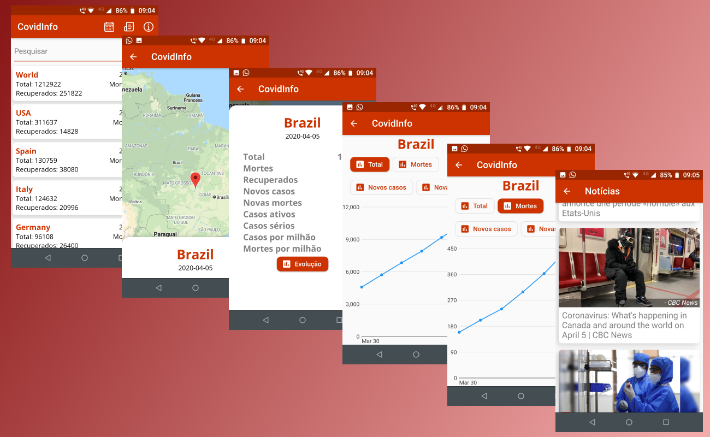

# CovidInfo

CovidInfo é um projeto que usei para estudo de algumas funcionalidades do Flutter.

Seu propósito é apresentar informações numéricas e notícias recentes sobre o Covid19.

Ele implementa o uso de plugins como [Dio](https://pub.dev/packages/dio) para chamadas http e [Moor](https://pub.dev/packages/moor) para acesso ao SQLite.

Também tentei separar a estrutura do projeto em camadas, usando BloC. Além disso, o app foi implementado para funcionar em multi-idiomas, estando atualmente configurado para inglês e português Brasil.

## Fontes

As informações apresentadas no app são extraídas das seguintes fontes:

- [Worldometer](https://www.worldometers.info/coronavirus/)
- [NewsAPI](https://newsapi.org/)

## Licença de uso

[MIT](https://choosealicense.com/licenses/mit/)